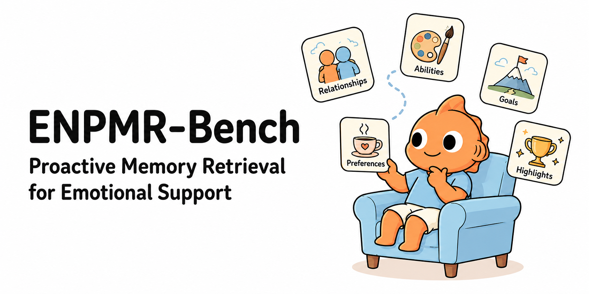

# ENPMR-Bench

[](https://aclanthology.org/2026.findings-acl.2080/)
[](data/pmr_bench_w_history_final.json)

Official repository for **[ENPMR-Bench: Benchmarking Proactive Memory Retrieval for Emotional Support Agents](https://aclanthology.org/2026.findings-acl.2080/)**, published in *Findings of ACL 2026*.

**Xing Fu, Yulin Hu, Mengtong Ji, Haozhen Li, Yixin Sun, Weixiang Zhao, Yanyan Zhao, and Bing Qin**

📄 [Paper](https://aclanthology.org/2026.findings-acl.2080/) · 📑 [PDF](https://aclanthology.org/2026.findings-acl.2080.pdf) · 📦 [Data](data/pmr_bench_w_history_final.json)

## Overview

**Which memories should an agent recall to support a user's emotional needs?**

ENPMR-Bench studies **Emotional Need-aware Proactive Memory Retrieval (ENPMR)**: identifying implicit emotional needs and selecting useful personal memories for empathetic conversation. Drawing on Maslow's hierarchy of needs, the benchmark connects emotional needs with supportive memory types.

The [paper](https://aclanthology.org/2026.findings-acl.2080/) evaluates embedding-based and LLM-driven retrieval. Both fall short of the golden-memory setting in empathy; chain-of-thought prompting improves need–memory alignment but leaves a substantial gap.

## Repository contents

```text
.
├── README.md
└── data/
    └── pmr_bench_w_history_final.json
```

## Dataset

The UTF-8 JSON file contains a **list of persona records**, each with profile information, dialogues, and a personal memory bank. Dialogue and memory content is primarily in Chinese; 

### Current file statistics

| Item | Count |
| --- | ---: |
| Persona records | 50 |
| Dialogue records (`dialog`) | 2,692 |
| Memory entries (`memory_bank`) | 11,846 |


| Dialogue memory type | Meaning | Count |
| --- | --- | ---: |
| `preference` | Personal preferences | 400 |
| `relationship` | Social relationships | 573 |
| `power` | Skills and abilities | 573 |
| `goal` | Personal goals | 573 |
| `highlight` | Memorable experiences and achievements | 573 |

### Data format

Each persona record contains the following fields:

| Field | Description |
| --- | --- |
| `id` | Persona identifier. |
| `persona` | English persona description. |
| `基本信息`, `人格特质`, `日常习惯与作息`, `社交关系`, `情绪模式`, `个人目标`, `沟通风格` | Structured profile attributes in Chinese. |
| `preference` | List of personal preferences. |
| `big_event` | Life themes/events with descriptions and dates. |
| `relationship`, `power`, `goal`, `highlight` | Structured memories grouped by life-theme keys. |
| `dialog` | List of benchmark dialogue records. |
| `memory_bank` | List of memory entries, including event text and historical dialogue. |
| `memory_bank_to_id` | Mapping from memory names/text to memory IDs within the persona record. |

Each record in `dialog` contains:

| Field | Description |
| --- | --- |
| `Scene` | Description of the dialogue scenario. |
| `Dialogue` | Ordered messages with `role` and `content`; roles are `用户` and `AI`. |
| `Memory Turn` | Annotated turn numbers at which memory is recalled. |
| `prompt` | Dialogue-generation prompt, including persona and target-memory information. |
| `big_event` | Associated life-theme key or a custom theme. |
| `type` | Target memory category. |
| `memory` | Target memory text/name. |

Entries in `memory_bank` contain `date`, `type`, `big_event`, `event` (memory text), and `dialog` (historical conversation text).

## Quick start

```python
import json
from pathlib import Path

data_path = Path("data/pmr_bench_w_history_final.json")
with data_path.open(encoding="utf-8") as f:
    personas = json.load(f)

print(f"Personas: {len(personas):,}")
print(f"Dialogues: {sum(len(p['dialog']) for p in personas):,}")
print(f"Memories: {sum(len(p['memory_bank']) for p in personas):,}")

person = personas[0]
example = person["dialog"][0]
print("\nScene:", example["Scene"])
print("Memory type:", example["type"])
print("Target memory:", example["memory"])

for message in example["Dialogue"]:
    print(f"{message['role']}: {message['content']}")

# Candidate memories and their associated historical conversations.
for memory in person["memory_bank"][:3]:
    print("\nMemory:", memory["event"])
    print("History:", memory["dialog"])
```

## Citation

If you find ENPMR-Bench useful, please cite our paper:

```bibtex
@inproceedings{fu-etal-2026-enpmr,
    title = "{ENPMR}-Bench: Benchmarking Proactive Memory Retrieval for Emotional Support Agents",
    author = "Fu, Xing  and
      Hu, Yulin  and
      Ji, Mengtong  and
      Li, Haozhen  and
      Sun, Yixin  and
      Zhao, Weixiang  and
      Zhao, Yanyan  and
      Qin, Bing",
    booktitle = "Findings of the {A}ssociation for {C}omputational {L}inguistics: {ACL} 2026",
    month = jul,
    year = "2026",
    address = "San Diego, California, United States",
    publisher = "Association for Computational Linguistics",
    url = "https://aclanthology.org/2026.findings-acl.2080/",
    doi = "10.18653/v1/2026.findings-acl.2080",
    pages = "41910--41933"
}
```
